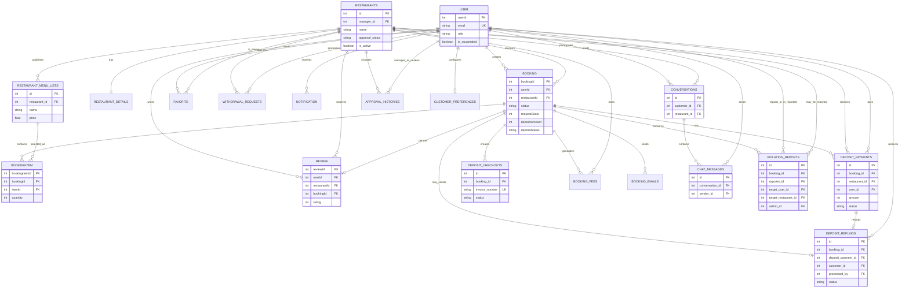

# ERD hệ thống TableNow

Tài liệu này phản ánh schema ở Alembic head `c1d2e3f4a5b6` và các model trong `backend-python/models`. Dùng sơ đồ dưới đây làm cơ sở để vẽ ERD trong đồ án.

## Nhóm bảng

| Nhóm | Bảng |
|---|---|
| Tài khoản và sở thích | `user`, `customer_preferences`, `favorite`, `notification` |
| Nhà hàng và thực đơn | `restaurants`, `restaurant_details`, `restaurant_menu_lists`, `approval_histories` |
| Đặt bàn | `booking`, `bookingitem`, `booking_emails`, `booking_fees`, `review` |
| Thanh toán | `payment`, `deposit_payments`, `deposit_checkouts`, `deposit_refunds`, `withdrawal_requests` |
| Trao đổi và xử lý vi phạm | `conversations`, `chat_messages`, `violation_reports` |

## Quy ước khi vẽ

- `user` là thực thể chung cho khách hàng, quản lý nhà hàng và quản trị viên; phân biệt bằng cột `role`.
- `booking` là trung tâm nghiệp vụ; một booking có thể chọn nhiều món qua `bookingitem`.
- `review` chỉ hợp lệ sau booking hoàn thành và chỉ một lần cho mỗi booking.
- `customer_preferences.user_id`, `notification.bookingId` và `notification.conversationId` là quan hệ nghiệp vụ được ứng dụng duy trì. Khi vẽ ERD, thể hiện chúng bằng đường quan hệ nét đứt nếu muốn phân biệt với foreign key vật lý.
- Một số quan hệ thanh toán là 0..1 theo quy tắc nghiệp vụ (ví dụ booking không yêu cầu cọc sẽ không có `deposit_payments`).